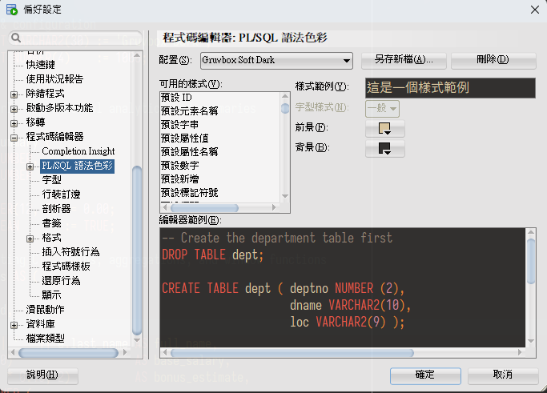

# Gruvbox Dark for Oracle SQL Developer

[English](#english) | [繁體中文](#繁體中文)

---

<a name="english"></a>
## English

> A retro groove dark theme for [Oracle SQL Developer](https://www.oracle.com/database/technologies/appdev/sql-developer.html), based on the classic [Gruvbox](https://github.com/morhetz/gruvbox) color scheme and structured after [dracula/oracle-sql-developer](https://github.com/dracula/oracle-sql-developer).


> **Font Recommendation**: [Sarasa Term TC (等距更紗黑體 TC)](https://github.com/be5invis/Sarasa-Gothic) (Size: 16) as demonstrated in the preview screenshot.  
> Set via **Tools** > **Preferences** > **Code Editor** > **Fonts**.


### Color Palette

| Syntax Element | Gruvbox Dark | Gruvbox Soft Dark | Role in Syntax |
| :--- | :--- | :--- | :--- |
| **Background** |  `#282828` |  `#32302f` | Editor background |
| **Foreground** |  `#ebdbb2` |  `#e0cda5` | Plain text, identifiers |
| **Red** |  `#fb4934` |  `#f3594b` | Keywords, attribute names |
| **Green** |  `#b8bb26` |  `#b1b946` | Strings, additions |
| **Yellow** |  `#fabd2f` |  `#e9b243` | Elements, constants, headers |
| **Orange** |  `#fe8019` |  `#f38534` | Operators, braces, delimiters |
| **Purple** |  `#d3869b` |  `#d3869b` | Numbers, units |
| **Gray** |  `#928374` |  `#928374` | Comments, unused text |
| **Dark Red** |  `#cc241d` |  `#cc241d` | Errors, deletions |
| **Selection** |  `#504945` |  `#504945` | Selection & highlight background |
| **Caret Line** |  `#3c3836` |  `#3c3836` | Current line highlight background |

### Installation

> [!WARNING]
> **Close Oracle SQL Developer completely before proceeding.**
> If you edit `dtcache.xml` while SQL Developer is open, the application will overwrite your changes upon exit.

#### 1. Locate `dtcache.xml`

Find the `dtcache.xml` file in your SQL Developer settings folder:

- **Windows**:
  ```text
  %APPDATA%\SQL Developer\system<version>\o.ide.<version>\dtcache.xml
  ```
  *(Example: `C:\Users\<Username>\AppData\Roaming\SQL Developer\system23.1.0.097.1607\o.ide.13.0.0.1.42.220309.2132\dtcache.xml`)*

- **macOS**:
  ```text
  ~/.sqldeveloper/system<version>/o.ide.<version>/dtcache.xml
  ```

- **Linux**:
  ```text
  ~/.sqldeveloper/system<version>/o.ide.<version>/dtcache.xml
  ```

#### 2. Insert Gruvbox Scheme

1. Open `dtcache.xml` with a text editor (e.g., VS Code, Notepad++).
2. Search for the `<schemeMap>` tag (located under `<Key>SyntaxSchemes</Key>` near the top of the file).
3. Paste the contents of [`Gruvbox-Dark.xml`](./Gruvbox-Dark.xml) and/or [`Gruvbox-Soft-Dark.xml`](./Gruvbox-Soft-Dark.xml) inside `<schemeMap>` (alongside built-in themes such as `Classic` or `Twilight`):
   ```xml
   <dt-cache class="java.util.HashMap" xmlns="http://xmlns.oracle.com/jdeveloper/110000/dt-cache">
      <Item>
         <Key>SyntaxSchemes</Key>
         <Value class="oracle.ide.ceditor.options.SyntaxSchemes">
            <schemeMap>
               <!-- Existing built-in themes (Classic, Default, etc.) -->
               <Item>
                  <Key>Classic</Key>
                  ...
               </Item>

               <!-- Paste Gruvbox <Item> blocks here (you can include both!) -->
               <Item>
                  <Key>Gruvbox Dark</Key>
                  ...
               </Item>
               <Item>
                  <Key>Gruvbox Soft Dark</Key>
                  ...
               </Item>
            </schemeMap>
         </Value>
      </Item>
   </dt-cache>
   ```
4. Save and close `dtcache.xml`.

#### 3. Activate the Theme

1. Launch **Oracle SQL Developer**.
2. Navigate to **Tools** > **Preferences** (工具 > 偏好設定).
3. In the left panel, expand **Code Editor** (程式碼編輯器) and select **PL/SQL Syntax Colors** (PL/SQL 語法色彩).
4. In the **Scheme** (配置) dropdown menu, choose **Gruvbox Dark** or **Gruvbox Soft Dark**.
5. Click **OK** (確定) to apply.



---

### Troubleshooting

- **Theme doesn't appear in the dropdown**:
  - Make sure SQL Developer was completely closed before modifying `dtcache.xml`.
  - Verify that `<Item>` and `</Item>` tags were correctly pasted inside `<schemeMap>` without breaking XML hierarchy.
- **Multiple version folders**:
  - If you upgraded SQL Developer previously, multiple `system<version>` folders might exist in `%APPDATA%` or `~/.sqldeveloper`. Make sure you are modifying the one corresponding to the version you are currently launching.

---

<a name="繁體中文"></a>
## 繁體中文

> 專為 [Oracle SQL Developer](https://www.oracle.com/database/technologies/appdev/sql-developer.html) 設計的復古暖色調 Gruvbox 暗色主題。配色靈感取自經典的 [Gruvbox](https://github.com/morhetz/gruvbox)，專案結構參考 [dracula/oracle-sql-developer](https://github.com/dracula/oracle-sql-developer)。


> **字型推薦**：預覽圖採用 [等距更紗黑體 TC (Sarasa Term TC)](https://github.com/be5invis/Sarasa-Gothic)（字型大小：16）。  
> 可於 **工具 (Tools)** > **偏好設定 (Preferences)** > **程式碼編輯器 (Code Editor)** > **字型 (Fonts)** 進行設定。


### 色票對照表

| 語法元素 | Gruvbox Dark (標準) | Gruvbox Soft Dark (柔和) | 說明 |
| :--- | :--- | :--- | :--- |
| **背景 (Background)** |  `#282828` |  `#32302f` | 編輯器底色 |
| **前景文字 (Foreground)** |  `#ebdbb2` |  `#e0cda5` | 一般文字、識別碼 (Identifier) |
| **紅色 (Red)** |  `#fb4934` |  `#f3594b` | 關鍵字 (Keyword)、屬性名稱 |
| **綠色 (Green)** |  `#b8bb26` |  `#b1b946` | 字串 (String)、新增內容 |
| **黃色 (Yellow)** |  `#fabd2f` |  `#e9b243` | 元素標籤、常數 (Constant)、標題 |
| **橘色 (Orange)** |  `#fe8019` |  `#f38534` | 運算子 (Operator)、括號 (Brace)、分隔符 |
| **紫色 (Purple)** |  `#d3869b` |  `#d3869b` | 數值 (Number)、單位 |
| **灰色 (Gray)** |  `#928374` |  `#928374` | 註解 (Comment)、廢棄項目 |
| **深紅 (Dark Red)** |  `#cc241d` |  `#cc241d` | 語法錯誤 (Error)、刪除內容 |
| **選取底色 (Selection)** |  `#504945` |  `#504945` | 文字選取區塊、符號高亮底色 |
| **當前行 (Caret Line)** |  `#3c3836` |  `#3c3836` | 游標所在行底色高亮 |

### 安裝步驟

> [!WARNING]
> **開始前請務必完全關閉 Oracle SQL Developer。**
> 若在 SQL Developer 開啟的狀態下修改 `dtcache.xml`，程式關閉時將會自動覆蓋並還原您的修改。

#### 1. 尋找設定檔 `dtcache.xml`

在系統設定資料夾中找到 `dtcache.xml`：

- **Windows 系統**：
  ```text
  %APPDATA%\SQL Developer\system<版本號>\o.ide.<版本號>\dtcache.xml
  ```
  *(範例：`C:\Users\<使用者名稱>\AppData\Roaming\SQL Developer\system23.1.0.097.1607\o.ide.13.0.0.1.42.220309.2132\dtcache.xml`)*

- **macOS 系統**：
  ```text
  ~/.sqldeveloper/system<版本號>/o.ide.<版本號>/dtcache.xml
  ```

- **Linux 系統**：
  ```text
  ~/.sqldeveloper/system<版本號>/o.ide.<版本號>/dtcache.xml
  ```

#### 2. 插入 Gruvbox 主題設定

1. 使用文字編輯器（如 VS Code、Notepad++ 等）開啟 `dtcache.xml`。
2. 搜尋標籤 **`<schemeMap>`**（位於檔案頂部 `<Key>SyntaxSchemes</Key>` 區塊內）。
3. 將 [`Gruvbox-Dark.xml`](./Gruvbox-Dark.xml) 或 [`Gruvbox-Soft-Dark.xml`](./Gruvbox-Soft-Dark.xml) 的完整內容貼入 `<schemeMap>` 與 `</schemeMap>` 標籤之間（可接在現有內建主題的 `</Item>` 之後）：
   ```xml
   <dt-cache class="java.util.HashMap" xmlns="http://xmlns.oracle.com/jdeveloper/110000/dt-cache">
      <Item>
         <Key>SyntaxSchemes</Key>
         <Value class="oracle.ide.ceditor.options.SyntaxSchemes">
            <schemeMap>
               <!-- 現有內建主題 (Classic, Default 等) -->
               <Item>
                  <Key>Classic</Key>
                  ...
               </Item>

               <!-- 在此貼入 Gruvbox 主題的 <Item> 區塊 (亦可兩者皆貼入) -->
               <Item>
                  <Key>Gruvbox Dark</Key>
                  ...
               </Item>
               <Item>
                  <Key>Gruvbox Soft Dark</Key>
                  ...
               </Item>
            </schemeMap>
         </Value>
      </Item>
   </dt-cache>
   ```
4. 儲存並關閉 `dtcache.xml`。

#### 3. 啟用主題

1. 啟動 **Oracle SQL Developer**。
2. 點擊頂端選單 **工具 (Tools)** > **偏好設定 (Preferences)**。
3. 在左側清單展開 **程式碼編輯器 (Code Editor)**，點選 **PL/SQL 語法色彩 (PL/SQL Syntax Colors)**。
4. 在右側的 **配置 (Scheme)** 下拉選單中，選擇 **Gruvbox Dark** 或 **Gruvbox Soft Dark**。
5. 點擊 **確定 (OK)** 即完成套用。


---

### 疑難排解

- **下拉選單未出現 Gruvbox**：
  - 請確認修改 `dtcache.xml` 前，SQL Developer 是否已確實完全關閉。
  - 檢查 XML 標籤是否完整閉合，且 `<Item>...</Item>` 確實放置於 `<schemeMap>` 之內。
- **存在多個版本目錄**：
  - 若曾升級過 SQL Developer，`%APPDATA%` 或 `~/.sqldeveloper` 中可能存在多個 `system<版本號>` 資料夾，請確認修改的是您目前正在執行的版本目錄。

---

## License

[MIT License](./LICENSE)
